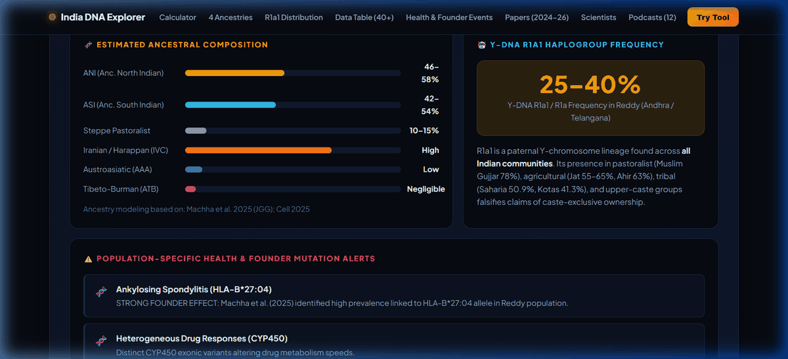
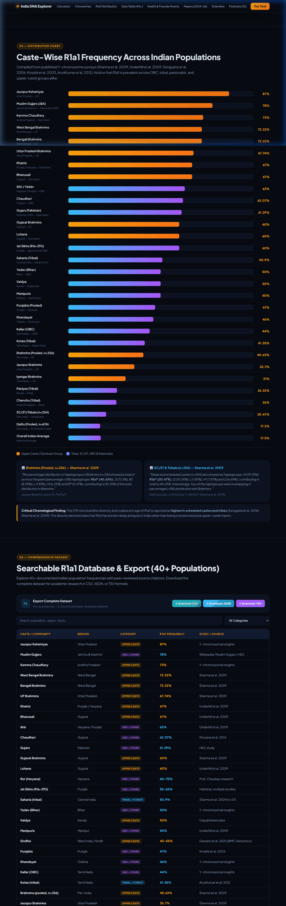
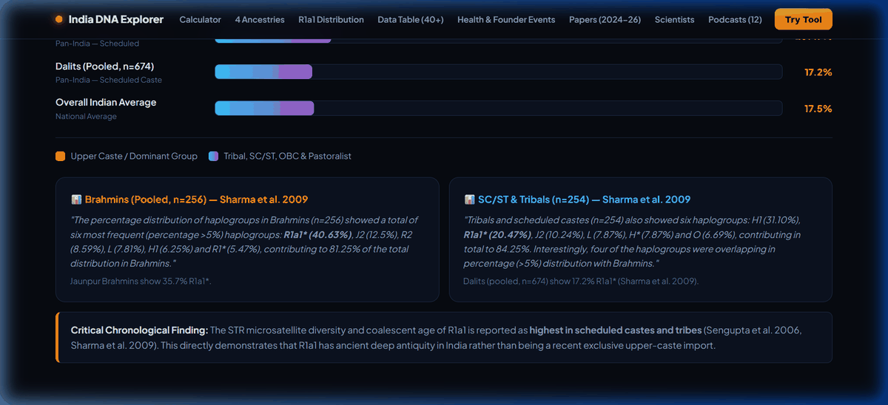
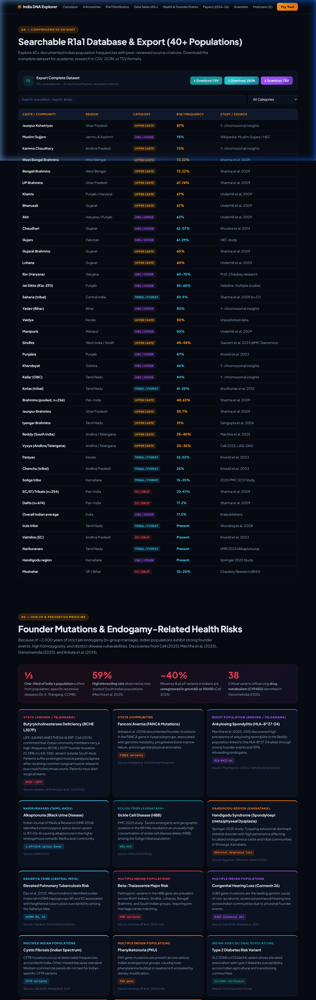
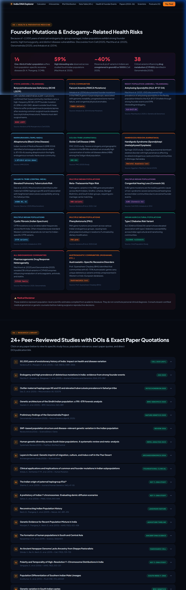
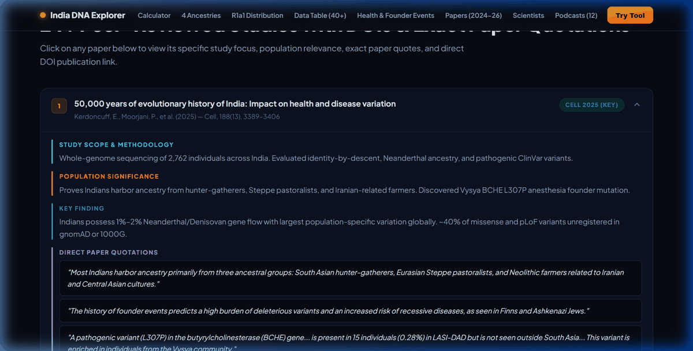
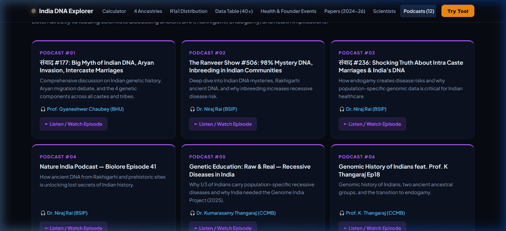
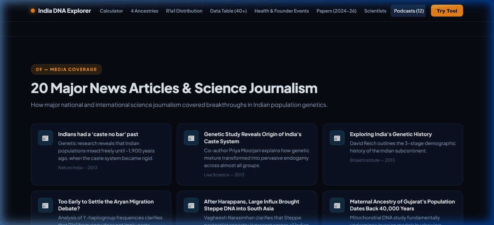
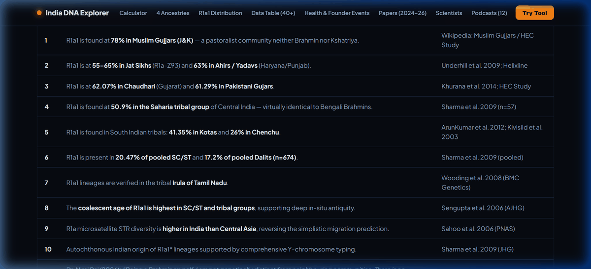

# India DNA Explorer: Genetics, R1a1 Distribution, Founder Mutations & Health Risks

[](https://alok-108.github.io/r1a1-science/)
[](LICENSE)
[](https://alok-108.github.io/r1a1-science/#papers)
[](https://alok-108.github.io/r1a1-science/#tool)
[](https://alok-108.github.io/r1a1-science/#table)

An open-access, research-backed genomic portal consolidating published population genetics research on the Indian subcontinent. Incorporating landmark discoveries from **Cell (2025)**, **Nature Genetics (GenomeIndia 2025)**, **Journal of Genetics and Genomics (Machha et al. 2025)**, **Mitochondrion (Das et al. 2025)**, and classical studies (*Reich 2009, Moorjani 2013, Sharma 2009, Sengupta 2006*).

🌐 **Live Web Application:** [https://alok-108.github.io/r1a1-science/](https://alok-108.github.io/r1a1-science/)

---

## Table of Contents
1. [Project Mission & Overview](#project-mission--overview)
2. [Interactive Features & Screenshots](#interactive-features--screenshots)
   - [01. Community & Regional Ancestry Calculator](#01-community--regional-ancestry-calculator)
   - [02. Frequency Distribution Charts (30+ Populations)](#02-frequency-distribution-charts-30-populations)
   - [03. The 3 Pooled Cohorts & AMOVA Analysis](#03-the-3-pooled-cohorts--amova-analysis)
   - [04. Searchable 40+ Population Database & Multi-Format Export](#04-searchable-40-population-database--multi-format-export)
   - [05. Genetic Health Risks, Founder Mutations & Pharmacogenomics](#05-genetic-health-risks-founder-mutations--pharmacogenomics)
   - [06. Peer-Reviewed Research Library (24+ Papers with DOIs)](#06-peer-reviewed-research-library-24-papers-with-dois)
   - [07. Leading Geneticists & Expert Interviews](#07-leading-geneticists--expert-interviews)
   - [08. Podcasts, Lectures & Science Journalism](#08-podcasts-lectures--science-journalism)
   - [09. Debunking the Myth: "The Claim vs The Evidence"](#09-debunking-the-myth-the-claim-vs-the-evidence)
3. [Key Scientific Findings Summary](#key-scientific-findings-summary)
4. [Technology Stack & Design System](#technology-stack--design-system)
5. [Local Development & Usage](#local-development--usage)
6. [Academic Citations](#academic-citations)
7. [Disclaimer](#disclaimer)

---

## Project Mission & Overview

Public discourse surrounding Indian population genetics is frequently clouded by pseudoscientific claims of caste-exclusive markers, racial hierarchies, and ungrounded origin myths. The **India DNA Explorer** provides a rigorous, transparent, citation-first scientific interface to:

- **Debunk the Upper-Caste Exclusivity Myth:** Demonstrate through empirical published frequencies that Y-chromosome haplogroup **R1a1** is omnipresent across Indian caste, tribal, pastoralist, and religious groups.
- **Model Multi-Layered Ancestry:** Illustrate the universal mixture of four ancestral components: **ANI** (*Ancestral North Indian*), **ASI** (*Ancestral South Indian*), **AAA** (*Ancestral Austro-Asiatic*), and **ATB** (*Ancestral Tibeto-Burman*).
- **Address Public Health Realities:** Highlight the medical implications of ~2,000 years of strict endogamous founder events—including recessive disorders, homozygous deleterious mutations, and pharmacogenomic drug response variants (GenomeIndia 2025, Cell 2025, JGG 2025).

---

## Interactive Features & Screenshots

### 01. Community & Regional Ancestry Calculator
Select from **60+ Indian castes, tribes, and regional communities** across North, South, East, West, Central, and Northeast India to view their estimated ancestral composition, R1a1 frequency ranges, endogamy tiers, and community-specific health alerts.



* **Calculated Components:** ANI, ASI, Steppe Pastoralist, Iranian Agriculturalist, Austroasiatic, and Tibeto-Burman proportions.
* **Targeted Health Alerts:** Displays documented recessive mutations such as *HLA-B\*27:04* (Reddy ankylosing spondylitis), *BCHE L307P* & *FANCA* (Vysya anesthesia and Fanconi anemia risks), *HBB* (Soliga & tribal sickle cell disease), and *Alkaptonuria c.87+1G>A* (Narikuravars).

---

### 02. Frequency Distribution Charts (30+ Populations)
Interactive animated bar charts displaying published R1a1 frequencies across more than 30 documented Indian populations.



* **Key Observation:** Groups with high R1a1 frequencies include **Jaunpur Kshatriyas (87%)**, **Muslim Gujjars (78%)**, **Kamma Chaudhary (73%)**, **West Bengal Brahmins (72.22%)**, **Khatris (67%)**, **Bhanusali (67%)**, **Ahirs/Yadavs (63%)**, **Chaudhari (62.07%)**, **Pakistani Gujars (61.29%)**, **Jat Sikhs (55–65%)**, **Central Indian Saharia Tribals (50.9%)**, and **South Indian Kotas Tribals (41.35%)**.

---

### 03. The 3 Pooled Cohorts & AMOVA Analysis
Direct empirical comparison of three pooled cohorts from Sharma et al. (2009) alongside Analysis of Molecular Variance (AMOVA) results.



| Cohort | Sample Size | Dominant Haplogroups | R1a1\* Frequency | Source |
|---|---|---|---|---|
| **Brahmins (Pooled)** | n=256 | R1a1\* (40.63%), J2 (12.5%), R2 (8.59%), L (7.81%), H1 (6.25%), R1\* (5.47%) | **40.63%** | Sharma et al. 2009 |
| **SC/ST & Tribals (Pooled)** | n=254 | H1 (31.10%), R1a1\* (20.47%), J2 (10.24%), L (7.87%), H\* (7.87%), O (6.69%) | **20.47%** | Sharma et al. 2009 |
| **Dalits (Pooled)** | n=674 | H1 (24.2%), R1a1\* (17.2%), R2 (14.2%), L (12.2%), F\* (9.8%), J7/J2 (6.4%), K\* (5.3%) | **17.20%** | Sharma et al. 2009 |

* **AMOVA Insight:** **89.63%** of genetic variation exists *within* populations; only **−2.30%** between geographical regions.
* **Lineage Continuity:** Haplogroup R lineage frequencies are 0.53 in Brahmins vs 0.41 in lower castes—proving continuity across the caste hierarchy without biological boundaries.

---

### 04. Searchable 40+ Population Database & Multi-Format Export
Filter and search through 40+ documented Indian populations with direct peer-reviewed citations. Includes instant client-side dataset exports in **CSV**, **JSON**, and **TSV** formats.



* **Export Formats Supported:**
  * `Download CSV` (`indian-r1a1-genetic-frequencies-40-populations.csv`)
  * `Download JSON` (`indian-r1a1-genetic-frequencies-40-populations.json`)
  * `Download TSV` (`indian-r1a1-genetic-frequencies-40-populations.tsv`)

---

### 05. Genetic Health Risks, Founder Mutations & Pharmacogenomics
Deep examination of how endogamy, population bottlenecks, and historical marriage boundaries have created population-specific health landscapes in India.



* **Key Statistics from Recent Literature:**
  * **⅓ of Indian Population:** Affected by population-specific recessive disease burden (Dr. K. Thangaraj, CCMB).
  * **59% Inbreeding Rate:** Documented across studied South Indian populations (Machha et al. 2025, JGG).
  * **~56 cM Average HBD:** Homozygous-by-descent segment length in South Indians (~29 cM pan-India) (*Cell* 2025).
  * **~51% Third-Degree Cousin Relatedness:** Sharing identity-by-descent blocks equivalent to third cousins or closer (*Cell* 2025).
  * **38 Pharmacogenomic Variants:** Identified in GenomeIndia Phase 1 (*Nature Genetics* 2025) impacting CYP450 drug metabolism.
  * **MYBPC3 25-bp Deletion:** Inherited cardiac gene deletion predisposing ~4% of Indians to late-onset cardiomyopathy.

---

### 06. Peer-Reviewed Research Library (24+ Papers with DOIs)
An interactive catalog of 24+ peer-reviewed papers spanning 2003 to 2026. Each entry provides study cohorts, methodology, population implications, exact paper quotations, and direct DOI publication links.



* **Key Studies Covered:**
  * *Kerdoncuff, Moorjani, et al. (Cell 2025)* — 50,000 years of evolutionary history of India.
  * *Machha et al. (Journal of Genetics and Genomics 2025)* — Strong founder events and deleterious mutations in India.
  * *Das et al. (Mitochondrion 2025)* — Outlier maternal haplogroups N5 and X2 in Sahariya tuberculosis.
  * *Gautam et al. (BMC Genomics 2025)* — 19X-STR forensic architecture of Sindhis.
  * *GenomeIndia Consortium (Nature Genetics 2025)* — 10,074 Indian genomes and 7 million novel variants.
  * *Sharma et al. (Journal of Human Genetics 2009)* — Indian origin of paternal haplogroup R1a1\*.
  * *Reich et al. (Nature 2009)* & *Moorjani et al. (AJHG 2013)* — Foundation of ANI/ASI ancestral mixing and date of caste formation (~1,900 ya).

---

### 07. Leading Geneticists & Expert Interviews
Extended quotations and academic context from prominent scientists in Indian and global population genetics:

* **Prof. Gyaneshwer Chaubey (BHU GyanLab):** COVID-19 protective loci (60% Indians), the Southeast Asian Austroasiatic Father Tongue hypothesis, and the four universal ancestral layers.
* **Dr. Niraj Rai (Birbal Sahni Institute Ancient DNA Lab):** Rakhigarhi ancient DNA, divergence ~10,000 ya, Harappan ancestry connecting all South Asians, and refuting biological caste divisions (*"No genetic basis for Brahmin, dalit or OBC identities"*).
* **Prof. Vasant Shinde (Deccan College Rakhigarhi Lead):** Continuity of Harappan civilization from 6000 BCE to modern South Asians.
* **Dr. Kumarasamy Thangaraj (CSIR-CCMB):** Recessive disease architecture, the MYBPC3 cardiomyopathy deletion, and the necessity of India's native genomic reference database.
* **Prof. David Reich (Harvard Medical School):** Full transcript excerpt from the *Dwarkesh Podcast* detailing **"The Freezing"**—the transition from open intermixture to rigid endogamy ~2,000–3,000 years ago documented across Rigvedic chronology.

---

### 08. Podcasts, Lectures & Science Journalism
A multimedia resource library containing:
* **12 Curated Scientific Podcasts & Lectures:**
  * *संवाद #177:* Big Myth of Indian DNA, Aryan Invasion, Intercaste Marriages (Prof. Chaubey).
  * *The Ranveer Show #506:* 98% Mystery DNA & Inbreeding in Indian Communities (Dr. Niraj Rai).
  * *संवाद #236:* Intra Caste Marriages & India's DNA (Dr. Niraj Rai).
  * *Nature India Biolore #41:* How ancient DNA is unlocking lost secrets.
  * *Genetic Education: Raw & Real (2025):* Recessive diseases and population genetics (Dr. K. Thangaraj).
  * *Hyper Quest Podcast:* DNA Reveals the Real History of Ancient India (Dr. Niraj Rai).
  * *Dwarkesh Podcast:* David Reich on how ancient DNA maps human history and the freezing of caste.
* **23 Science Journalism Articles:** Feature pieces from *Nature, Science, The Week, Indian Express, Times of India, The Caravan, EurekAlert, Drishti IAS*, and *Genetics and Society*.

| Curated Podcasts (12 Episodes) | Science Journalism (23 Articles) |
|---|---|
|  |  |

---

### 09. Debunking the Myth: "The Claim vs The Evidence"
Direct, side-by-side empirical refutation of viral pseudoscientific assertions:



#### Summary of Key Evidence Points

| # | Pervasive Social Claim | Peer-Reviewed Empirical Reality | Scientific Reference |
|---|---|---|---|
| **1** | *"R1a1 is found only in upper castes"* | R1a1 is found in Jats (55–65%), Gujjars (78%), Chaudhari (62.07%), SC/ST (20.47%), Dalits (17.2%), Chenchu (26%), Kotas (41.35%), and Saharia tribals (50.9%). | Multiple peer-reviewed studies |
| **2** | *"R1a1 is absent in SC/ST"* | R1a1\* is present at **20.47%** in pooled SC/ST/Tribals (n=254) and **17.2%** in pooled Dalits (n=674). | Sharma et al. 2009 (*JHG*) |
| **3** | *"R1a1 is a recent Aryan import"* | R1a microsatellite STR diversity is higher in India than Central Asia; coalescent age is highest in SC/ST and tribal groups, proving ancient autochthonous presence. | Sahoo et al. 2006 (*PNAS*); Sengupta et al. 2006 |
| **4** | *"Caste has a racial genetic basis"* | There is no genetic basis for caste divisions; all Indians are highly mixed across four ancestral lineages (ANI, ASI, AAA, ATB). | Dr. Niraj Rai (*The Week* 2026); Moorjani et al. 2013 |
| **5** | *"Harappans were not related to modern Indians"* | *"All of us are descendants of Harappans"* — genetic and archaeological continuity confirmed from 6000 BCE to present day. | Prof. Vasant Shinde (*The Week* 2024); Shinde et al. 2019 |
| **6** | *"Steppe ancestry is exclusive to upper castes"* | Steppe pastoralist ancestry (10–22%) is present across all Indian groups and regions, not exclusive to any single caste tier. | Narasimhan et al. 2019 (*Science*) |
| **7** | *"No population-specific disease risk"* | ⅓ of Indians suffer from population-specific recessive diseases due to thousands of years of strict endogamous founder events. | Dr. K. Thangaraj (2025); *Cell* 2025; *JGG* 2025 |

---

## Key Scientific Findings Summary

1. **Autosomal Admixture Precedes Endogamy:**
   Prior to ~1,900 to 4,200 years ago, pervasive, unconstrained intermarriage occurred across the Indian subcontinent (Moorjani et al. 2013). The caste system froze this fluid mixture in place through cultural endogamy, not distinct racial origins (Reich 2009, 2018).
2. **Four Universal Ancestral Lineages:**
   Modern Indians are an admixed cline of Ancestral North Indian (ANI), Ancestral South Indian (ASI), Ancestral Austro-Asiatic (AAA), and Ancestral Tibeto-Burman (ATB). No community is genetically "pure" or isolated from these foundational layers.
3. **Indigenous Harappan Agriculture:**
   Ancient DNA from Rakhigarhi (Shinde et al. 2019) demonstrated that Iranian-related lineages in Harappans diverged from Iranian agriculturalists prior to 10,000 BCE, indicating that South Asian agriculture developed indigenously rather than via mass demic diffusion from the Fertile Crescent.
4. **Clinical Importance of Native Reference Genomes:**
   Eurocentric polygenic risk scores underperform significantly in South Asian populations. Discoveries from GenomeIndia (135M variants, 7M novel) and Machha et al. (1,284 unreported exonic variants) demonstrate why population-specific genomic reference databases are essential for precision healthcare.

---

## Technology Stack & Design System

* **Architecture:** Ultra-fast, single-page application built with clean, semantic **HTML5**, **Vanilla Modern CSS**, and **Vanilla ES6+ JavaScript**.
* **Zero Dependencies:** No heavy JavaScript frameworks, bundlers, or external CSS libraries required—ensuring instantaneous client-side load times (<100ms) and offline resilience.
* **Design Aesthetic:**
  * **Color Palette:** Tailored dark glassmorphic scheme utilizing Deep Void (`#070a11`), Surface Slate (`#0f172a`), Imperial Gold (`#f0b429`), Electric Cyan (`#38bdf8`), and Royal Purple (`#a855f7`).
  * **Typography:** `Plus Jakarta Sans` for body and UI; `JetBrains Mono` for genetic notations, alleles, and statistical metrics.
  * **Visual Polish:** CSS Grid & Flexbox layouts, dynamic progress bars with intersection observer animations, custom toast notifications, and accessible tab navigation.

---

## Local Development & Usage

Clone the repository and open `index.html` in any modern web browser:

```bash
# Clone the repository
git clone https://github.com/alok-108/r1a1-science.git

# Navigate into the project folder
cd r1a1-science

# Open directly in your browser (Windows PowerShell)
Start-Process index.html

# Or run with any lightweight HTTP server
npx serve .
```

---

## Academic Citations

If utilizing the aggregated datasets or data summaries for research or educational purposes, please cite the primary literature:

```bibtex
@article{kerdoncuff2025,
  title={50,000 years of evolutionary history of India: Impact on health and disease variation},
  author={Kerdoncuff, Elise and Moorjani, Priya and others},
  journal={Cell},
  volume={188},
  number={13},
  pages={3389--3406},
  year={2025},
  doi={10.1016/j.cell.2025.04.027}
}

@article{machha2025,
  title={Endogamy and high prevalence of deleterious mutations in India: evidence from strong founder events},
  author={Machha, P. and Gopalan, A. and Elangovan, Y. and others},
  journal={Journal of Genetics and Genomics},
  volume={52},
  number={4},
  pages={570--582},
  year={2025},
  doi={10.1016/j.jgg.2025.02.001}
}

@article{sharma2009,
  title={The Indian origin of paternal haplogroup R1a1*},
  author={Sharma, S. and Rai, E. and Sharma, P. and others},
  journal={Journal of Human Genetics},
  volume={54},
  number={1},
  pages={47--55},
  year={2009},
  doi={10.1038/jhg.2008.2}
}

@article{reich2009,
  title={Reconstructing Indian population history},
  author={Reich, David and Thangaraj, Kumarasamy and others},
  journal={Nature},
  volume={461},
  pages={489--494},
  year={2009},
  doi={10.1038/nature08365}
}
```

---

## Disclaimer

The data and calculators presented in this portal represent population-level averages and risk models compiled from academic, peer-reviewed genomic publications. They are intended solely for educational, historical, and scientific purposes. They do not constitute personal clinical genetic diagnosis. Individuals seeking diagnostic evaluations or carrier screening should consult a board-certified clinical geneticist or genetic counselor.

---

**Portal Maintained by:** [Alok](https://github.com/alok-108)  
**Live Portal:** [https://alok-108.github.io/r1a1-science/](https://alok-108.github.io/r1a1-science/)
